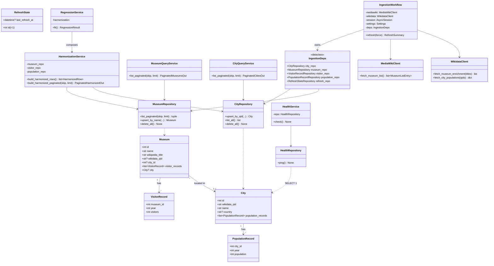
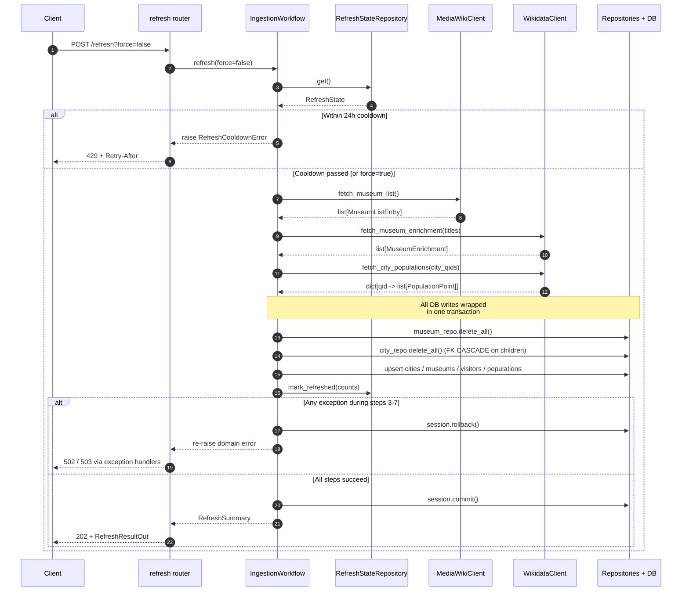
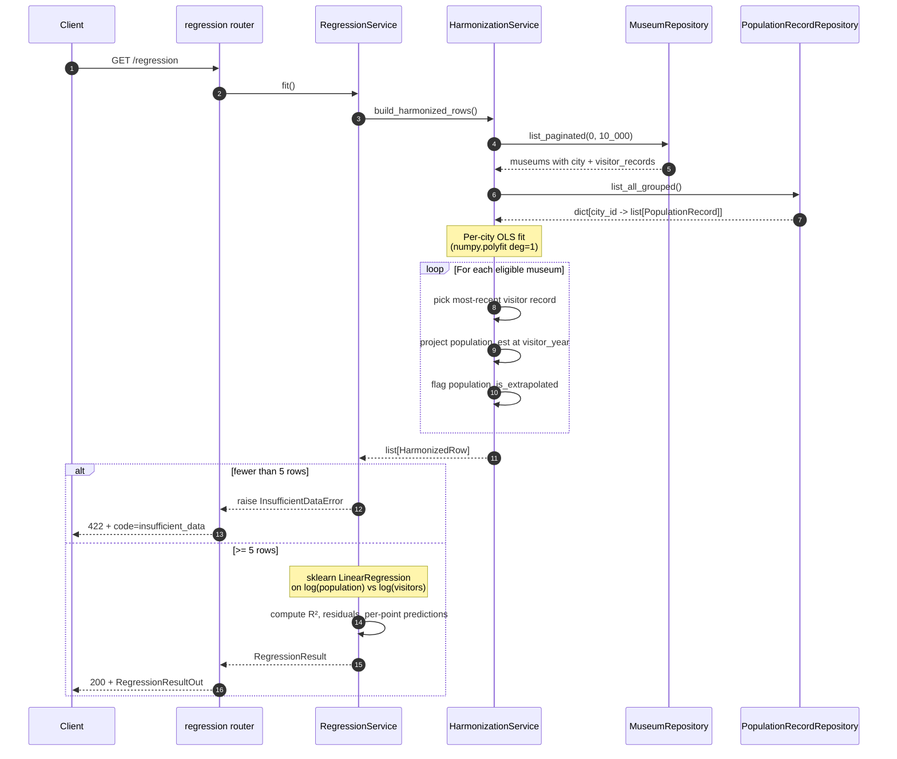
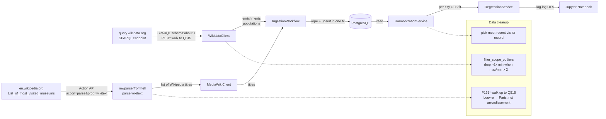
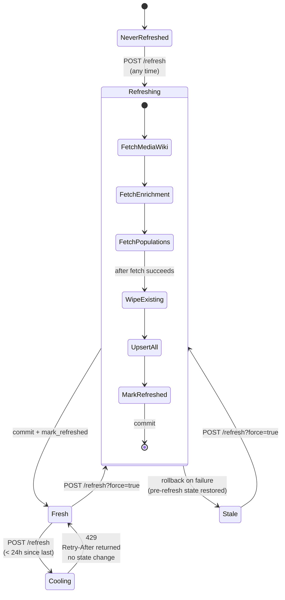

# Architecture Diagrams

GitHub renders Mermaid natively, so these diagrams display inline when
browsing the repo. Local preview: `scripts/generate_diagrams.py` renders
each block to an SVG under `docs/diagrams/` via `npx
@mermaid-js/mermaid-cli`.

## Class Diagram — Layered Architecture

High-level view of the `src/museums/` module layout: data → repositories
→ services/workflows → routers + schemas, with clients as a side-branch
for external APIs.

## Sequence Diagram — `POST /refresh?force=false`

The full ingestion path, including the cooldown guard, transactional
wipe-before-insert, and rollback on upstream failure.

## Sequence Diagram — `GET /regression`

Read-side pipeline: harmonization fits per-city OLS, regression fits
log-log OLS on the harmonized output.

## Data Flow — End-to-end view

From Wikipedia raw page all the way to the notebook's regression plot.

## Refresh Policy — State Machine

`RefreshState` itself is not an FSM per our architectural rules (no
`status` field), but the refresh operation has a clear state machine
around the 24h cooldown.

